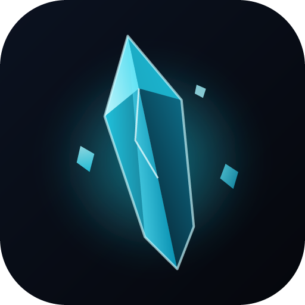

<p align="center">
  
</p>

<h1 align="center">Shard Launcher</h1>
<p align="center"><strong>Sharpen your crystal PvP.</strong><br/>The launcher for Shard, a Fabric-based crystal-PvP client for Minecraft 1.21 and every version after.</p>

---

Shard Launcher is a production Electron launcher for crystal PvP players, built around the Shard
Client:

- **Microsoft sign-in** with the full Xbox Live → XSTS → Minecraft Services chain, PKCE in a
  popup, device-code fallback, silent refresh, multi-account, encrypted token storage.
- **Every Minecraft release from 1.21 onwards, forever.** The version list is read from Mojang on
  every start and filtered, never hard-coded. New versions appear automatically.
- **Shard Core**: a bundled, auto-updating mod set (Fabric API, Sodium, Lithium, Iris, Entity
  Culling, FerriteCore, ImmediatelyFast, Krypton, Dynamic FPS, Sodium Extra, Reese's Sodium
  Options, Mod Menu, Cloth Config) resolved from Modrinth per Minecraft version, plus the Shard
  client jar from the client manifest.
- **Shared config layer** so Sodium/Iris/… settings are identical on every version.
- **Robust launch pipeline**: resumable, parallel, hash-verified downloads of the client, libraries
  and assets; managed Java runtimes (Mojang runtime manifest with Adoptium fallback); Fabric
  profile merging; live console with crash detection.
- **Modrinth mod browser** with dependency resolution, update checks, conflict warnings,
  `.mrpack` import and "copy my mods to another version".
- **3D player** (skinview3d), **skin changer** (upload, from username, from URL, library, capes),
  **cosmetics wardrobe** with live cape/elytra preview.
- **Self-updates** through GitHub Releases, Discord Rich Presence, offline mode.

See [DECISIONS.md](DECISIONS.md) for why things are the way they are and
[CONTRACT.md](CONTRACT.md) for the data contract with the Shard client.

## Requirements

- Node.js 20 or newer (22 recommended), npm 10+.
- Windows 10/11, macOS 12+, or a Linux desktop. Building a platform's installer requires that
  platform (CI does all three).
- No Java is required to develop: the launcher downloads the Java runtime each Minecraft version
  asks for.

## Quick start

```bash
npm install
cp .env.example .env     # then fill in MSA_CLIENT_ID (see below)
npm run dev
```

`npm run dev` starts electron-vite with hot reload for the renderer and automatic restarts for
the main process. The launcher stores everything under the Shard data directory
(`%APPDATA%/Shard`, `~/Library/Application Support/Shard`, `~/.local/share/Shard`).

Without an `MSA_CLIENT_ID` the launcher runs, but the account chip shows a setup card and
signing in is disabled. Everything that does not need an account (browsing versions, installing
instances, browsing Modrinth, the wardrobe) still works.

### Scripts

| Script | What it does |
| --- | --- |
| `npm run dev` | Development mode with hot reload. |
| `npm run build` | Builds `out/` (main, preload, renderer). |
| `npm run typecheck` | TypeScript for the Node side (`tsconfig.node.json`) and the renderer (`tsconfig.web.json`). |
| `npm run lint` / `npm run lint:fix` | ESLint (flat config, typescript-eslint, react-hooks). |
| `npm run format` | Prettier. |
| `npm test` | Vitest unit tests (auth chain, launch arguments, rules, Fabric merge, Modrinth client, version filtering, manifests, …). |
| `npm run icons` | Regenerates all app icons from `resources/icon.svg`. |
| `npm run dist[:win|:mac|:linux]` | Typecheck, build and package installers into `dist/`. |

### Smoke screenshot

The main process supports a headless render check used by CI:

```bash
npm run build
SHARD_SMOKE_SCREENSHOT=$PWD/smoke.png npx electron .
```

It opens the window, captures a PNG after load and quits.

## Environment variables

Read from the shell at runtime and, through electron-vite's `envPrefix`, from `.env` at build
time (so a packaged build carries them). Settings → Integrations can override the URLs per user.

| Variable | Required | Purpose |
| --- | --- | --- |
| `MSA_CLIENT_ID` | for sign-in | Azure app registration (consumers tenant) client id. Can also be pasted into Settings → Accounts. |
| `MSA_REDIRECT_URI` | no | Defaults to `http://localhost/shard-auth`. Must match the app registration. |
| `SHARD_MANIFEST_URL` | no | Hosted `shard-manifest.json` (client builds). |
| `SHARD_BUNDLED_MODS_URL` | no | Hosted `bundled-mods.json` (overrides the shipped set). |
| `SHARD_COSMETICS_URL` | no | Hosted `cosmetics.json`. |
| `MODRINTH_CONTACT` | no | Contact placed in the Modrinth `User-Agent` (email or URL). Defaults to the GitHub repository URL. |
| `SHARD_DATA_DIR` | no | Portable mode: settings, accounts, logs and all game data live in this folder instead of the platform default. Runtime only. |

## Microsoft sign-in setup

Third-party launchers need two things: an Azure app registration (so Microsoft issues tokens
to your app) and Mojang's approval to call the Minecraft Services API with those tokens.

### 1. Azure app registration

1. Open the [Azure portal](https://portal.azure.com) → **Microsoft Entra ID** → **App registrations** → **New registration**.
2. Name: `Shard Launcher`. Supported account types: **Personal Microsoft accounts only**
   (the consumers tenant; Minecraft accounts are personal accounts).
3. Redirect URI: platform **Mobile and desktop applications**, value `http://localhost/shard-auth`
   (or whatever you set in `MSA_REDIRECT_URI`). Loopback URIs are exempt from the port check, which
   is why no local HTTP server is needed; the launcher intercepts the redirect inside the sign-in window.
4. After creation open **Authentication** and set **Allow public client flows** to **Yes**. This
   enables the device-code fallback.
5. Open **API permissions** → **Add a permission** → **APIs my organization uses** → search
   `Xbox Live` → delegated permission **XboxLive.signin**. Grant it. `offline_access` is a standard
   OpenID scope and needs no extra configuration.
6. Copy the **Application (client) ID** into `.env` as `MSA_CLIENT_ID`. There is no client secret:
   this is a public client using PKCE.

### 2. Mojang "Minecraft API access" approval

Microsoft tokens from a new client id are rejected by `api.minecraftservices.com` until Mojang
allow-lists the client id. Submit the **Minecraft Game Service Access** form at
<https://aka.ms/mce-reviewappid> (Mojang's support article about it is
<https://help.minecraft.net/hc/en-us/articles/16254801392141>). You will be asked for the client
id, the launcher name, a description of what it does, a contact email and how tokens are stored.
Approval typically takes a few days to a few weeks. Until then sign-in fails at the "Minecraft
services" stage with a 403; the launcher surfaces this as a sign-in failure with the server
message.

### What the launcher does with the tokens

`Microsoft access token → Xbox Live user token → XSTS token (RelyingParty rp://api.minecraftservices.com/)
→ login_with_xbox → entitlements/mcstore → minecraft/profile`. Refresh tokens are encrypted with
Electron `safeStorage` (DPAPI on Windows, Keychain on macOS, libsecret/kwallet on Linux) and
stored in `<config>/accounts.json`. Tokens never appear in logs. There is no offline or
"cracked" mode: an account that owns Minecraft: Java Edition is required; installed instances can
still be launched offline with the last verified session.

Known XSTS errors are translated: no Xbox profile (2148916233), child account needs a family
(2148916238), region unavailable (2148916235), adult verification (2148916236/7), banned
(2148916227). Game Pass accounts with no Java profile are told to create one at minecraft.net.

## Editing the bundled mod set (Shard Core)

The set is data: [`src/main/mods/bundled-mods.json`](src/main/mods/bundled-mods.json).

```jsonc
{
  "slug": "sodium",                       // Modrinth project slug
  "name": "Sodium",
  "required": false,                      // true = cannot be disabled (Fabric API)
  "locked": true,                         // cannot be removed by the user
  "description": "…",
  "configFiles": ["config/sodium-options.json"]   // part of the shared config layer
}
```

- Add or remove entries, then run `npm test` (the manifest is validated) and ship a launcher
  release, **or** publish the same JSON to the `meta` repository as `bundled-mods.json`: the hosted
  copy overrides the shipped one on every start without a launcher update.
- `sharedFiles` lists extra files synced across instances (`options.txt`, `servers.dat`).
- `conflicts` lists Modrinth slugs the Mods tab refuses to install silently.
- Each slug is resolved at install time to the newest release-channel file for the instance's
  Minecraft version (`/v2/project/{slug}/version?loaders=["fabric"]&game_versions=[…]`), verified
  by sha512, with required dependencies resolved recursively. Mods without a build for a new
  Minecraft version show as "Waiting for update" and install themselves once published.

## Shard client builds

The launcher looks for `shard-manifest.json` (format in [CONTRACT.md](CONTRACT.md)). Until the
first build is published every version is **Client pending**: instances install and launch as
Fabric + Shard Core with a banner, and the Updates tab explains the state. Publishing a build is a
JSON commit; no launcher release is needed.

## Project layout

```
src/
  main/            Electron main process (ESM)
    auth/          Microsoft → Xbox → Minecraft chain, encrypted account store
    minecraft/     version manifest, version JSON, rules, arguments, libraries, assets
    fabric/        loader resolution and profile merge
    java/          managed runtimes (Mojang manifest, Adoptium fallback)
    instances/     instance registry and folders
    launch/        pipeline, process management, console, crash detection
    modrinth/      API client with rate limiting
    mods/          Shard Core sync, user mods, .mrpack import, bundled-mods.json
    shard/         client manifest, jar sync, launcher-info.json, shared config layer
    cosmetics/     wardrobe manifest, equipped.json
    updates/       electron-updater, GitHub release notes, Mojang news
    discord/       Rich Presence over Discord IPC
    ipc/           typed router and core handlers
    net/           HTTP client, parallel verified downloader
  preload/         the single `window.shard` bridge (sandboxed, CommonJS, Zod-validated)
  renderer/        React app (pages, design system, stores, hooks)
  shared/          types, Zod schemas, IPC contract, version rules shared by all three
resources/         icon.svg, generated icons, bundled cosmetics (the OhMarker cape)
scripts/           icon generator, OhMarker cape builder (sources in art/ohmarker-cape)
tests/             Vitest unit tests
.github/workflows/ CI (lint, typecheck, test, build, smoke screenshots) and tag releases
```

Security model: `contextIsolation: true`, `nodeIntegration: false`, `sandbox: true`. The
renderer can only call allow-listed IPC channels through `window.shard.invoke`, every input is
validated with Zod in the preload **and** in the main process, and errors cross the bridge as
stable codes rather than stack traces.

## Build and release

```bash
npm run dist:win      # NSIS installer (x64 + arm64) + portable single .exe (x64)
npm run dist:mac      # universal DMG
npm run dist:linux    # AppImage + .deb
```

Windows builds produce two downloads:

| File | What it is |
| --- | --- |
| `shard-launcher-setup-<version>-x64.exe` | Installer. Start-menu entry, auto-updates in place. |
| `ShardLauncher-portable.exe` | One self-contained file. Nothing to install: download, double-click, play. It cannot update itself, so the Updates tab links to the newest download instead. Data still lives in `%APPDATA%/Shard` unless `SHARD_DATA_DIR` is set. The name carries no version, so `https://github.com/OhMarker/shard-launcher/releases/latest/download/ShardLauncher-portable.exe` is a permanent direct-download link to the newest build; the download page (`docs/`) points straight at it. |

Offer both on your download page; most players want the portable one.

Releases are automated: push a tag `v1.2.3` and `.github/workflows/release.yml` lints, tests,
builds all three platforms and publishes the installers plus the `latest*.yml` update feeds to the
GitHub release. electron-updater in the launcher reads those feeds (stable channel = releases,
beta channel = prereleases). Configure these repository secrets/variables:

| Secret / variable | Purpose |
| --- | --- |
| `MSA_CLIENT_ID` (secret) | baked into the build |
| `SHARD_MANIFEST_URL`, `SHARD_BUNDLED_MODS_URL`, `SHARD_COSMETICS_URL`, `MODRINTH_CONTACT` (variables) | optional overrides |
| `CSC_LINK`, `CSC_KEY_PASSWORD` (secrets) | optional Windows/macOS code-signing certificate |
| `APPLE_ID`, `APPLE_APP_SPECIFIC_PASSWORD`, `APPLE_TEAM_ID` (secrets) | optional macOS notarisation (set `notarize: true` in `electron-builder.yml`) |

Update `publish.owner`/`publish.repo` in `electron-builder.yml` and `GITHUB_OWNER`/`GITHUB_REPO`
in `src/shared/constants.ts` if you fork the project.

## Troubleshooting

| Symptom | Cause / fix |
| --- | --- |
| Account chip says **Sign-in not configured** | No `MSA_CLIENT_ID`. Add it to `.env` (rebuild) or paste it in Settings → Accounts. |
| Sign-in fails at "Minecraft services" with 403 | The client id is not approved by Mojang yet (see above). |
| "This Microsoft account has no Xbox profile" | Create an Xbox profile at xbox.com with that account. |
| "This account needs to be added to a family" | Under-18 accounts must be in a Microsoft family group. |
| "No Java Edition profile yet" | Game Pass account: create a profile at minecraft.net → My games → Profile. |
| Downloads stall or fail with checksum errors | Check Settings → Launch → download concurrency (lower it on flaky networks) and run **Repair** on the instance; partial files resume automatically. |
| Game launches but a bundled mod is missing | The mod has no build for that Minecraft version yet; the Mods tab shows "Waiting for update". It installs on the next launch once published. |
| Instance shows **Client pending** | No Shard client build for that version. Fabric + Shard Core still launches. |
| Updates tab says "unsupported" | You are running from source or an unpackaged build; electron-updater only works in installers. |
| Launcher looks stuck on "Starting Shard…" | The preload bridge failed to load. Run `npm run build` again and check `<config>/logs/launcher.log`. |
| Where are the logs? | Settings → Storage → **Open logs**, or `<config>/logs/launcher.log` (rotated, tokens scrubbed). Game output is in the in-app console and `<instance>/logs/`. |
| Moving the data directory failed halfway | Nothing is deleted until the copy verifies; the old folder is intact. Pick an empty target folder and retry. |

## License

MIT. Minecraft is a trademark of Mojang Studios; Shard Launcher is not affiliated with Mojang or
Microsoft. Minecraft game files are downloaded from Mojang at runtime and never bundled.
